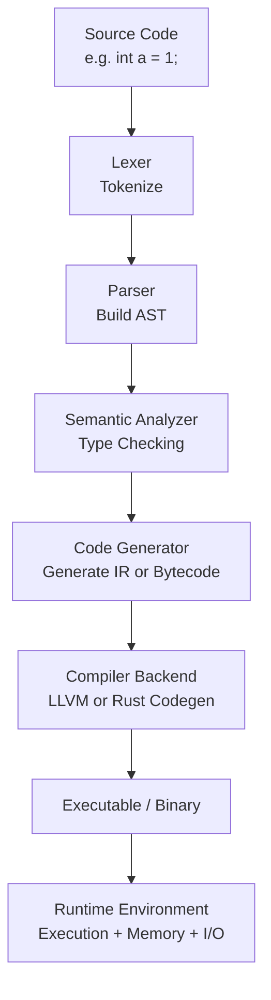

# jex

## Overview

> jex is a Java-like Language processor that operaters without the JVM. 
> It directly analyzes and executes Java source code, running on the Rust time. :) 

## Features
* `JVM-independent` : Standalone execution environment without JVM dependency
* `Rust-based` : Implemented in safe and fast Rust
Direct interpretation: Directly analyzes and executes source code
* `Lightweight` : Operates efficiently with minimal dependencies

## install && build

```shell
git clone https://github.com/SteelCrab/jex.git

cd jex

cargo build --release 
```


