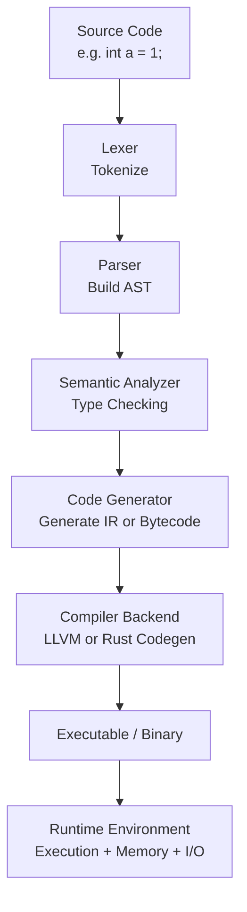

# jex

project to implement a Java compiler in Rust

## install

```shell
git clone https://github.com/SteelCrab/jex.git

cd jex 
```


```mermaid
flowchart TD
    A[Source Code<br/>e.g. int a = 1;] --> B[Lexer<br/>Tokenize]
    B --> C[Parser<br/>Build AST]
    C --> D[Semantic Analyzer<br/>Type Checking]
    D --> E[Code Generator<br/>Generate IR or Bytecode]
    E --> F[Compiler Backend<br/>LLVM or Rust Codegen]
    F --> G[Executable / Binary]
    G --> H[Runtime Environment<br/>Execution + Memory + I/O]

```