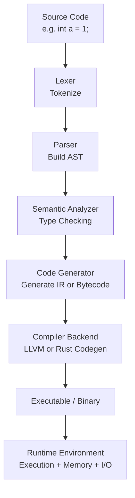

# jex

## Overview

> jex is a Java-like Language processor that operaters without the JVM. 
> It directly analyzes and executes Java source code, running on the Rust time. :) 

## Features
* `JVM-independent` : Standalone execution environment without JVM dependency
* `Rust-based` : Implemented in safe and fast Rust
Direct interpretation: Directly analyzes and executes source code
* `Lightweight` : Operates efficiently with minimal dependencies

## install && build

```shell
git clone https://github.com/SteelCrab/jex.git

cd jex

cargo build --release 
```



## Contributing Guidlines

### How to Contribute

1. Fork the repository
2. Create your feature branch (`git checkout -b feature/amazing-feature`)
3. Commit your changes (`git commit -m 'feat:  great feature'`)
4. Push to the branch (`git push origin feature/great-feature`)
5. Open a Pull Request

### AI Usage Policy

We welcome contributions that utilize AI tools. :) 
please follow these guidelines

#### Requirements

1. **Disclose AI Tools**
   - Clearly specify which AI tool and model you used
   - Examples: Claude 3.5 Sonnet, ChatGPT-4, GitHub Copilot, etc.
     
2. **State Purpose of Use**
   - Describe how you used AI in your PR description
   - Examples: Documentation, test code generation, code review, refactoring suggestions, etc.

3. **Verification Responsibility**
   - AI-generated code must be reviewed and tested by the contributor
   - All tests must pass
   - The contributor is responsible for the final code quality
     
#### PR Template
```markdown
## AI Usage Information (if applicable)
- **AI Tool Used**: (e.g., Claude 3.5 Sonnet)
- **Purpose**: (e.g., test code generation, JavaDoc writing)
- **Scope**: (e.g., 50% test code, 30% comments)
- **Verification Completed**: 
  - [ ] Code review completed
  - [ ] All tests passed
  - [ ] Documentation updated
```

#### Recommendations

- Mark AI-generated sections with comments when possible
```java
  // AI-generated (Claude): 2024-11-11
  // Reviewed and modified by: [Your Name]
```
- Record generation date and modification history

## 💡 **About AI Tools**

> You are free to use AI tools for your contributions. However, keep in mind that **with great power comes great responsibility**. AI-generated code may occasionally pose maintenance challenges. Use AI wisely and think about long-term maintainability.
